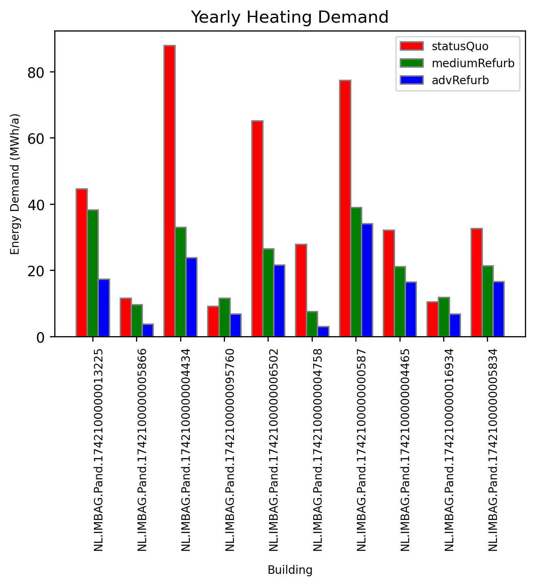

<h1>Heating Demand Analysis</h1>

This repository is the culmination of a Heating Demand Analysis project whose objectives were to prepare CityGML data for energy simulations using CitySim following 3 refurbishment scenarios, process the temporal and thematic results and incorporate them in a 3DCityDB extended with the Energy ADE KIT Profile.

<h2>Data</h2>
<ol>
	<li>Weather</li>
		<ul>
			<li>Diffuse horizontal irradiance</li>
			<li>Beam (solar) normal irradiance</li>
			<li>Air temperature</li>
			<li>Ground surface temperature</li>
			<li>Wind speed</li>
			<li>Wind direction</li>
			<li>Relative Humidity</li>
			<li>Precipitation</li>
			<li>Nebulosity</li>
		</ul>
	<li>3D building geometry in an (Energy ADE extended) 3DCityDB</li>
	<li>Building physics parameters</li>
</ol>

<h2>Registering CitySim results in 3DCityDB extended with EnergyADE (KIT Profile)</h2>

Simulation results were processed to as to: 
<ol>
	<li>populate the extended 3DCityDB tables associated with following objects specified by the CityGML and Energy ADE KIT Profile data models
		<ul>
			<li>EnergyDemand</li>
			<li>TimeSeries</li>
			<li>RegularTimeSeries</li>
			<li>GenericAttribute</li>
		</ul> 
	</li> 
	<li>visualise the yearly energy demand for the 10 most voluminous buildings with respect to three refurbishment scenarios:
		<ul>
			<li>statusQuo - no improvements</li>
			<li>mediumRefurb - some improvements</li>
			<li>advRefurb - significant improvements</li>
		</ul>
	</li>
</ol>
 

  

<h2>Acknowledgements</h2>

I would like to acknowledge <a href="https://github.com/calsgeo">Camilo Leon Sanchez</a> who provided the original CitySim XML generator Python script.

